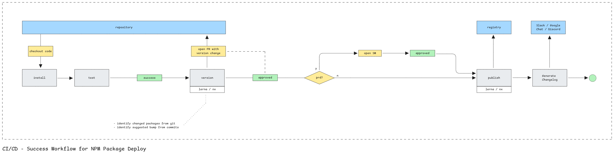

# PoC: Monorepo with independent version for packages

This is a simple PoC based on lerna and npm workspaces.
- [x] The @poc/core library is consumed by @poc/auth;
- [x] lerna is able to control which package should be publish, based on the git;
    history;
- [x] each package has its own version;
- [x] changing @poc/core triggers a new version for @poc/auth;



- [ ] semantic version bump is infered from convetional commits;
- [ ] the worker opens a PR with the suggested version and waits for approval;

## Requirements
- learn
- nx
- node

## Common tasks

To install dependencies:

```shell
npm install
```

To publish (after git changes from last version):

```shell
lerna version --no-push
```

To see the dependency graph:
```shell
nx graph
```

# References
- [Conventional Recommeded Bump](https://github.com/conventional-changelog/conventional-changelog/tree/master/packages/conventional-recommended-bump)
- [Lerna - independent version](https://lerna.js.org/docs/features/version-and-publish#independent-mode)
- [Npm Workspaces (oficial docs)](https://docs.npmjs.com/cli/v11/using-npm/workspaces)
